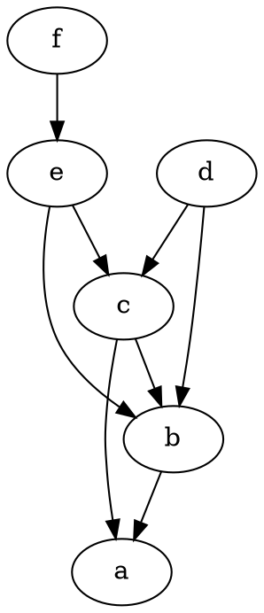

This is the second part in a series of posts regarding [CurateND's](https://curate.nd.edu/) Library Collection development.
The series will dive into the details of implementing a new type of collections within our [Hydra ecosystem](https://projecthydra.org/).

Before reading this one, please read [the previous post for background information](/practices/2016-06-17-background-for-library-sponsored-collections).

## Whiteboarding Sessions for Graphs

My colleague - [Hello Don!](http://www3.nd.edu/~dbrower/) - has extensive graph experience.
I've also dabbled with graphs both in college and in other ventures.

We spent a bit of time whiteboarding a few probable scenarios and came up with the following as a starting state:

From there we worked through a few events:

* Add `f isMemberOfCollection c`
* Add `a isMemberOfCollection e` (a cycle)
* Add `a isMemberOfCollection g` (adding a higher level collection)

These were the initial scenarios that we would test.
We talked a bit about what information we would capture.

### Aside

The above diagrams were generated via [Graphviz](https://graphviz.org) using the following DOT notation:

I haven't had much luck controlling the visual layout of DOT notation, but am quite happy creating visual graphs from textual representation.

## Foundation

I am a strong advocate for test driven development; I have found that the process improves the maintainability, legibility, and extensibility of the code I write. If its hard to test, it'll be hard to maintain.

In our early discussions, we described:

* Initial state of the graph
* The event that would add to the graph
* Resulting state of the graph

I had a few acceptance tests scenarios that I could work with.

### Tests Would Be Fast

I also want to iterate on solutions with fast tests. With a rapid feedback, I can move quickly in my design.
With the desire for fast tests, I was interested in exploring graph building and indexing outside of the CurateND ecosystem.
*Writing to Fedora and SOLR would be required, but using those technologies to iterate on the indexing algorithm was going to be a major speed impediment.*

### Stubbing out both the Index and Preservation Layer

I wasn't going to interact with Fedora and SOLR, but I needed to test state changes.
The solution was to think about the required interface with Fedora and SOLR.

#### Fedora Interface

As part of the setup of the initial state, I need to write objects to Fedora.
In this case, an object in Fedora would have:

* Identifier
* Set of identifiers for its `isMemberOfCollection` objects.

As part of the event processing, I need to find objects in Fedora.
I believe I will only need to find one object at a time; So a find by identifier method.

#### Solr Interface

As part of the setup of the initial state, I need to write objects to SOLR.
In this case, an object in SOLR would have:

* Identifier
* Identifiers for relationships (more on this in a later blog post)

As part of the event processing, I need to find objects in SOLR.
There will be similarities to Fedora, but I assume I'll need additional relationship finding options.
Again, more on the Index finder methods in a later blog post.

### Modeling the Indexing Process

The initial thoughts regarding indexing was to walk up through an object's `isMemberOfCollection` relationships; and keep walking until:

* All referenced objects through `isMemberOfCollection` have been visited
* We have visited N-levels of ancestors (i.e. Time to Live)

During those visits, we would append to the index each nodes descendant information.

More on this process in a later post.

#### Aside Regarding Software Mentoring

For the last 15 months, I have been a mentor for [the Firehose Project](http://thefirehoseproject.com/). During this time, I have had numerous students work through the curriculum.

And when each of them work through Breadth First and Depth First Tree-Traversal, I've said that I have never used breadth first tree-traversal. That is no longer true, with the Library Collections work we agreed that breadth first tree-traversal made the most sense.

Had I not been a mentor, I might've floundered a bit on the implementation.
Instead I was prepared to roll a quick solution.

## Up Next

In the [next installment](/posts/2016-06-24-solving-library-sponsored-collections), I'll talk about the Solution.
